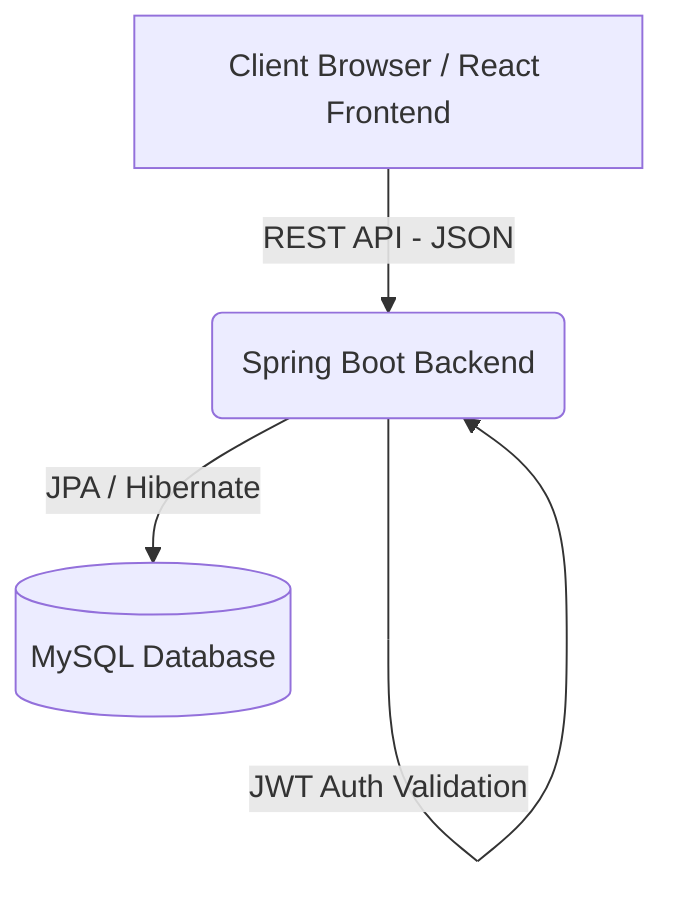

# ERP System for Inventory and Sales Management (Java + React)

A comprehensive Enterprise Resource Planning (ERP) system designed to streamline inventory tracking, manage complex sales pipelines, process purchasing workflows, and provide actionable analytics. Built with a robust Java Spring Boot backend and a modern React.js frontend.

## 🚀 Core Features
*   **Role-Based Access Control (RBAC)**: Secure JWT-based authentication supporting distinct roles (`Admin`, `Sales Executive`, `Purchase Manager`, `Inventory Manager`, `Accountant`) tailored to exact module capabilities.
*   **Real-time Inventory via GRN**: Dynamic stock management powered by Goods Receipt Notes (GRN). Converting an approved Purchase Order into a GRN instantly processes transaction integrity and updates real-time inventory levels.
*   **Automated PDF Invoices**: Streamlined workflow triggers auto-generation of an Invoice with precise tax calculations (18% GST) whenever a Sales Order is approved. PDF instances are readily downloadable.
*   **Interactive Analytics Dashboard**: Live metrics rendering total monthly revenues, dynamically generated top-selling product charts, and immediate low-stock threshold alerts.

## 🛠 Tech Stack

### Backend
*   **Java 17**
*   **Spring Boot 3.x**
*   **Spring Security & JWT**
*   **Spring Data JPA**
*   **MySQL**
*   **OpenPDF** (Invoice Generation)

### Frontend
*   **React.js (v18+)**
*   **Vite**
*   **Material UI (MUI) & DataGrid**
*   **React Hook Form & Yup**
*   **Recharts** (Analytics Visualization)

## 🏗 Architecture Diagram
The system utilizes a standard 3-tier architecture separating the Presentation, Logic, and Data layers:



*   **Presentation Layer**: React Single Page Application (SPA) utilizing Vite for lightning-fast module reloading.
*   **Application Layer**: Spring Web MVC endpoints routing through Service layers mapped with critical transactional bounds (`@Transactional`).
*   **Data Layer**: Relational MySQL database managed organically through Spring Data JPA repositories.

## ⚙️ Setup Instructions

### 1. Database & Backend Configuration
1.  Ensure you have **MySQL** installed and running on port `3306`.
2.  Create a fresh database named `erp_system`:
    ```sql
    CREATE DATABASE erp_system;
    ```
3.  Navigate to the `./backend/src/main/resources` directory and update `application.properties` with your native MySQL credentials:
    ```properties
    spring.datasource.url=jdbc:mysql://localhost:3306/erp_system?useSSL=false&serverTimezone=UTC
    spring.datasource.username=root
    spring.datasource.password=your_password_here
    ```
4.  Run the application using your IDE or via Maven: 
    ```bash
    cd backend
    ./mvnw spring-boot:run
    ```

### 2. Frontend Configuration
1.  Ensure you have **Node.js** (v18+) installed.
2.  Navigate to the `frontend` directory:
    ```bash
    cd frontend
    ```
3.  Install the core dependencies:
    ```bash
    npm install
    ```
4.  Start the development server:
    ```bash
    npm run dev
    ```

## 📖 API Documentation
The API lifecycle features live configuration specs powered by **SpringDoc OpenAPI**. 
Once the backend server is running locally, access the interactive Swagger UI payload at:

👉 [http://localhost:8080/swagger-ui.html](http://localhost:8080/swagger-ui.html)

## 🧪 Testing Coverage
Thorough testing frameworks are integrated to ensure operational stability:
*   **Backend Validation**: Methodical test layouts executed via **JUnit 5** and **Mockito**, specifically verifying complex logic such as `totalAmount` mathematical bounds in `SalesOrderService` and precise stock manipulation during operations in `GRNService`.
*   **Frontend End-to-End**: Comprehensive UI testing routed primarily utilizing **Vitest** structurally merged with **React Testing Library (RTL)** to process Document Object Models simulating realistic input scenarios within `LoginForm` boundaries to ensure exact input capturing against payload expectations.
